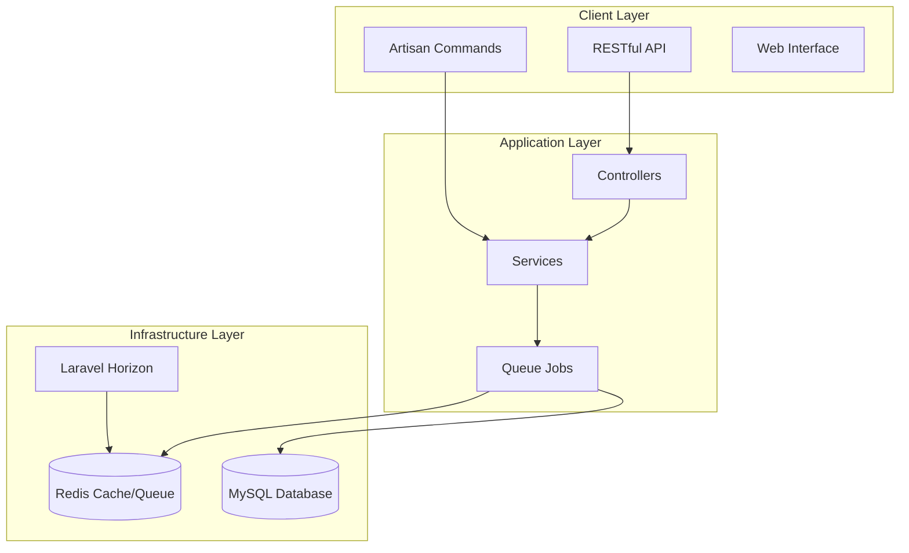

# order-management-system
A production-ready order management system built with Laravel that handles large-scale CSV imports, complex order workflows, real-time analytics, and asynchronous refund processing. This project demonstrates enterprise-level Laravel development with proper queue management, caching strategies, and system design.
Table of Contents

Features
System Architecture
Requirements
Installation
Configuration
Usage
API Documentation
System Design
Testing
Performance
Monitoring
Contributing
License


# ✨Features
🔄 Order Processing System

Large CSV Import: Chunked processing for files with 100K+ records
Multi-step Workflow: Stock reservation → Payment processing → Order finalization
Automatic Rollback: Intelligent error recovery and stock release
Queue-based Processing: Asynchronous job handling with priority queues

📊 Real-time Analytics

Live KPIs: Daily revenue, order count, average order value
Customer Leaderboard: Top customers by total spending
Redis-powered: Sub-millisecond response times for analytics queries
Auto-updating: KPIs adjust instantly with orders and refunds

💸 Refund Management

Partial & Full Refunds: Flexible refund amount handling
Idempotency Protection: Safe re-execution without data corruption
Asynchronous Processing: Non-blocking refund workflows
Real-time Updates: Immediate KPI and leaderboard adjustments

📧 Notification System

Multi-channel Notifications: push notifications (extensible)
Complete Audit Trail: Full history of all notifications sent
Queue Integration: Non-blocking notification delivery

🔧 Infrastructure Features

Laravel Horizon: Advanced queue monitoring and management
Supervisor Integration: Process management and auto-restart
Comprehensive Logging: Structured logging with separate channels
Error Handling: Robust exception handling with detailed reporting

# 🏗️ System Architecture


# Key Components:
| **Component**        | **Technology**    | **Purpose**                           |
|----------------------|-------------------|---------------------------------------|
| **Web Framework**     | Laravel 12.x      | Application foundation                |
| **Database**          | MySQL 8.0+        | Persistent data storage               |
| **Cache & Queues**    | Redis 6.0+        | Real-time data & job processing       |
| **Queue Management**  | Laravel Horizon   | Queue monitoring & scaling            |
| **Process Management**| Supervisor         | Worker process management             |

# 📋 Requirements
System Requirements

PHP: 8.2+ with extensions: redis, mysql, gd, curl  
Composer: 2.0+  
Database: MySQL 8.0+  
Cache: Redis 6.0+  
Queue: Redis  
Process Manager: Supervisor  

Development Requirements

Node.js: 18+ (for asset compilation)

# 🚀 Installation

1. Install Dependencies
```bash
# PHP dependencies
composer install

# Node dependencies (if using frontend)
npm install
```
2. Database Setup
```bash
# Run migrations
php artisan migrate

# Seed sample data
php artisan db:seed
```
3. Queue Setup
```bash
# Create jobs table
php artisan queue:table
php artisan migrate

# Install Horizon
php artisan horizon:install
```
4. Start Services
```bash
# Start Laravel development server
php artisan serve

# Start queue workers (separate terminal)
php artisan horizon
```
# Supervisor Configuration
Create /etc/supervisor/conf.d/laravel-horizon.conf:

# 📖 Usage
CSV Order Import
Import orders from CSV file:
```bash
php artisan orders:import /path/to/orders.csv
```
CSV Format:
```bash
customer_email,customer_name,order_number,total_amount,items
john@example.com,"John Doe",ORD-001,299.99,"[{""sku"":""LAPTOP"",""quantity"":1,""unit_price"":299.99}]"
```

# Monitor Queue Processing
```bash
# Check Horizon status
php artisan horizon:status

# Monitor logs
tail -f storage/logs/laravel.log
```

# 🔌 API Documentation

```bash
# Get daily KPIs
curl -X GET "http://your-app.com/api/v1/kpis/daily?date=2025-09-19"

# Get customer leaderboard
curl -X GET "http://your-app.com/api/v1/kpis/leaderboard?limit=10"

# Create a refund
curl -X POST "http://your-app.com/api/v1/orders/1/refunds" \
  -H "Content-Type: application/json" \
  -d '{"amount": 100.00, "type": "partial", "reason": "Customer request"}'

# Get order details
curl -X GET "http://your-app.com/api/v1/orders/1"
```

## Queue Architecture

| Queue Priority | Job Types                | Configuration                                  |
|----------------|--------------------------|------------------------------------------------|
| high           | ProcessOrderWorkflow, ProcessRefund | timeout=300s, tries=1-3                      |
| default        | ProcessOrderImport, SendNotification | timeout=60s, tries=3                        |
| low            | UpdateKPIs, CleanupJobs  | timeout=30s, tries=1                          |

# ⚡ Performance
## Benchmarks

| **Operation**        | **Throughput**         | **Response Time**     |
|----------------------|------------------------|-----------------------|
| **CSV Import**       | 10,000+ orders/min     | N/A                   |
| **Order Processing** | 500+ orders/min        | ~2s per order         |
| **KPI Queries**      | 10,000+ req/sec        | <1ms                  |
| **API Requests**     | 1,000+ req/sec         | <100ms                |


### Optimization Strategies
### Database Optimizations

Strategic indexing on frequently queried columns  
Query optimization with eager loading  
Database connection pooling  
Read replicas for analytics queries  

### Redis Optimizations

Atomic operations for concurrent updates  
Memory-efficient data structure  
Pipelining for bulk operations  

### Queue Optimizations

Priority-based job processing  
Chunked batch processing  
Worker scaling based on load  
Failed job retry strategies  
